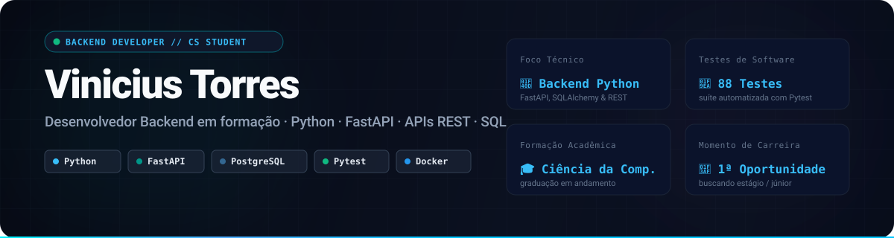
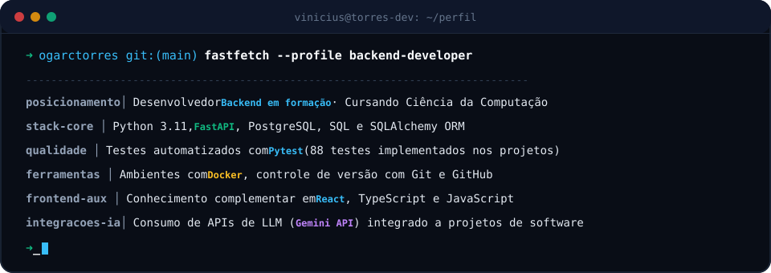

  

---

### Sobre Mim

Estudante de **Ciência da Computação** com foco em **Desenvolvimento de Software** e **Backend**. Desenvolvo projetos práticos aplicando princípios de engenharia de software: arquitetura em camadas, criação de APIs REST documentadas, persistência com bancos de dados relacionais, suítes de testes automatizados e deploy em produção.

Busco oportunidade de estágio na área de desenvolvimento de software para somar em times de engenharia, contribuir na construção de aplicações escaláveis e continuar evoluindo tecnicamente.

  

---

### Tech Stack

| Categoria | Tecnologias |
| :--- | :--- |
| **Linguagens** | Python, JavaScript, SQL *(Java em aprofundamento ativo)* |
| **Backend & APIs** | FastAPI, Flask, REST APIs, Pydantic, Marshmallow, Pytest *(88+ testes automatizados)* |
| **Bancos de Dados & ORM** | PostgreSQL, SQLite, SQLAlchemy ORM |
| **Frontend** | React (React 19, Vite), Next.js, HTML5/CSS3 |
| **DevOps & Ferramentas** | Git, GitHub, Docker, Docker Compose, Deploy (Vercel, Render) |

---

### Projeto Principal em Destaque

#### ⚡ Vektor — Plataforma de Inteligência de Vagas e Carreira
Aplicação Full Stack em produção que realiza a ingestão e leitura de currículos em PDF, compara competências com vagas reais do mercado de tecnologia em tempo real e fornece diagnóstico de compatibilidade, reescrita de currículo para sistemas ATS e plano de estudos personalizado.

* **Arquitetura & Backend:** API assíncrona estruturada em **FastAPI**, com tipagem e validação via Pydantic, rotas REST modularizadas e documentação OpenAPI/Swagger interativa.
* **Frontend:** Interface responsiva construída em **React 19** com Vite, consumindo a API com interceptadores e tratamento defensivo de estados.
* **Banco de Dados:** Persistência relacional com **SQLAlchemy ORM** e schema DDL para **PostgreSQL**, com índices de performance e Row Level Security (RLS).
* **Integrações & IA:** Consumo de APIs de vagas em tempo real (Jooble e Adzuna) e integração com a Google Gemini API com mecanismo de resiliência e fallback para avaliações em lote.
* **Qualidade de Software:** Suíte com **88 testes automatizados** utilizando Pytest e FastAPI TestClient cobrindo regras de negócio e rotas ponta a ponta.
* **DevOps & Deploy:** Containerização com **Dockerfile** e **Docker Compose**; deploy contínuo em produção no Render (API) e Vercel (Frontend).

🔗 **[Ver Repositório](https://github.com/ogarctorres/job-matcher-)** • **[Aplicação no Ar](https://vektor-career.vercel.app)** • **[Swagger Docs da API](https://vektor-0nam.onrender.com/docs)**

---

### Outros Projetos Relevantes

<table>
  <tr>
    <td width="50%" valign="top">
      <h4>🔐 API de Tarefas com Autenticação JWT</h4>
      
API REST completa construída em Flask com autenticação stateless por token JWT, controle de acesso por usuário, persistência via SQLAlchemy e documentação automática Swagger.

      
<strong>Destaques:</strong> Autenticação segura com Flask-JWT-Extended, validação de schemas com Marshmallow, cobertura de testes automatizados com Pytest.

      
<code>Python</code> <code>Flask</code> <code>SQLAlchemy</code> <code>JWT</code> <code>Pytest</code> <code>Swagger</code>

      <a href="https://github.com/ogarctorres/api-tarefas-flask-jwt"><strong>Ver Repositório →</strong></a>
    </td>
    <td width="50%" valign="top">
      <h4>📈 Painel Econômico Brasil (Boletim BCB)</h4>
      
Dashboard Full Stack em produção que consome dados em tempo real da API oficial do Banco Central do Brasil (SGS) para monitoramento de Selic, Dólar e IPCA.

      
<strong>Destaques:</strong> Ingestão e tratamento de dados de API pública, persistência relacional para evitar requisições redundantes, gráficos interativos com Chart.js e deploy no Render.

      
<code>Python</code> <code>Flask</code> <code>SQLite</code> <code>JavaScript</code> <code>Chart.js</code> <code>Deploy Render</code>

      <a href="https://github.com/ogarctorres/dashboard-economico-brasil"><strong>Ver Repositório →</strong></a> • <a href="https://dashboard-economico-brasil-3.onrender.com/"><strong>Acessar Projeto →</strong></a>
    </td>
  </tr>
  <tr>
    <td width="50%" valign="top">
      <h4>🧭 Bus Factor Radar</h4>
      
Ferramenta de engenharia de software que analisa o histórico de commits de repositórios Git públicos e mapeia, através de um grafo interativo, onde o conhecimento técnico está concentrado em uma única pessoa.

      
<strong>Destaques:</strong> Análise de autoria por arquivo via Git log, cálculo de risco algorítmico no backend e visualização interativa com React Flow.

      
<code>Python</code> <code>FastAPI</code> <code>Git API</code> <code>Next.js</code> <code>React Flow</code>

      <a href="https://github.com/ogarctorres/bus-factor-radar"><strong>Ver Repositório →</strong></a>
    </td>
    <td width="50%" valign="top">
      <h4>⏱️ Code Time Machine</h4>
      
Ferramenta para acompanhamento histórico da evolução da complexidade de código Python ao longo do tempo em repositórios Git.

      
<strong>Destaques:</strong> Extração de histórico temporal de arquivos com Git, cálculo de complexidade ciclomática e métricas com a biblioteca Radon, exibição em gráficos temporais.

      
<code>Python</code> <code>FastAPI</code> <code>Radon</code> <code>Git</code> <code>Recharts</code>

      <a href="https://github.com/ogarctorres/code-time-machine"><strong>Ver Repositório →</strong></a>
    </td>
  </tr>
</table>

---

### Atualmente Estudando & Direção Técnica

* **Java & Ecossistema Spring:** Estudando Programação Orientada a Objetos, Spring Boot 3, Spring Data JPA e testes com JUnit 5 para expandir a atuação em sistemas corporativos de alta demanda. *(Desenvolvendo projeto prático de API REST bancária/crédito)*.
* **Estruturas de Dados e Algoritmos:** Aprofundamento contínuo em complexidade de tempo/espaço e resolução de problemas práticos.
* **Bancos de Dados Relacionais & Modelagem:** Otimização de consultas, índices e integridade referencial em PostgreSQL.

---

### Atividade & Contribuições

  <picture>
    <source media="(prefers-color-scheme: dark)" srcset="https://raw.githubusercontent.com/ogarctorres/ogarctorres/output/github-contribution-grid-snake-dark.svg" />
    <source media="(prefers-color-scheme: light)" srcset="https://raw.githubusercontent.com/ogarctorres/ogarctorres/output/github-contribution-grid-snake.svg" />
    
  </picture>

---

### Conecte-se Comigo

  
  
  

